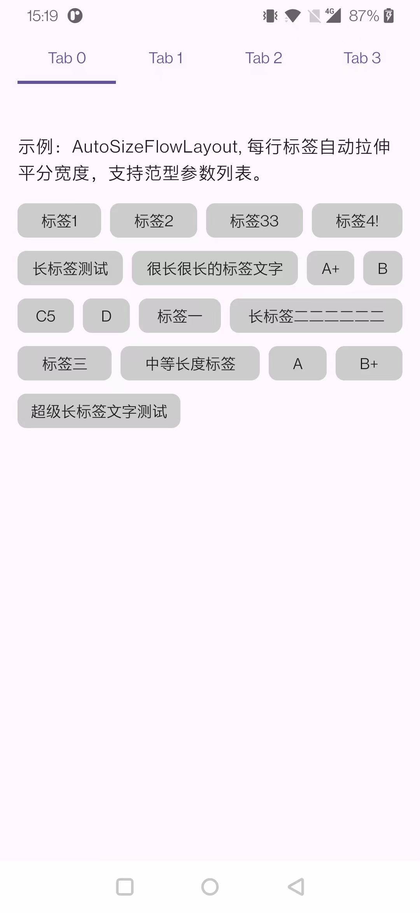
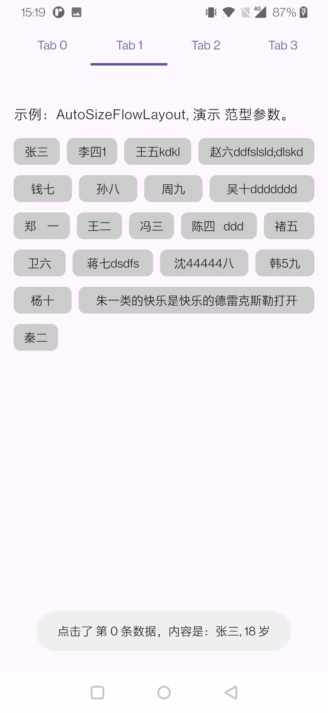
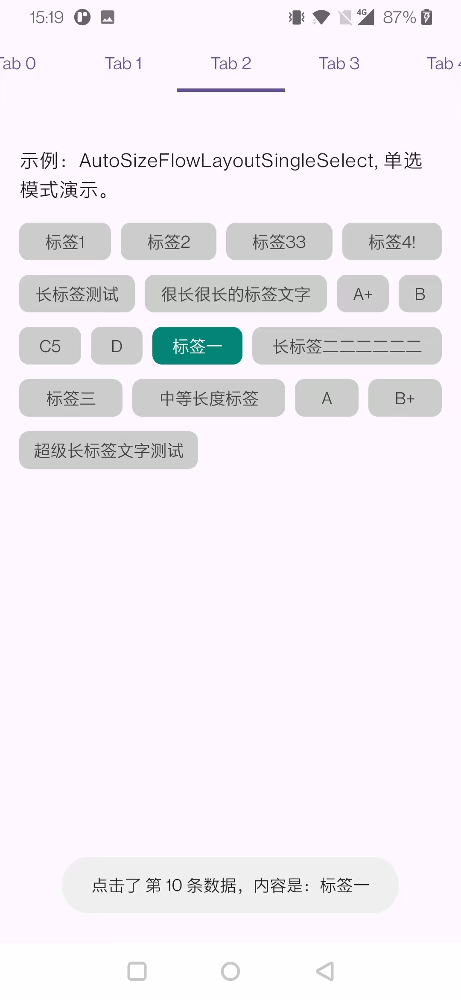
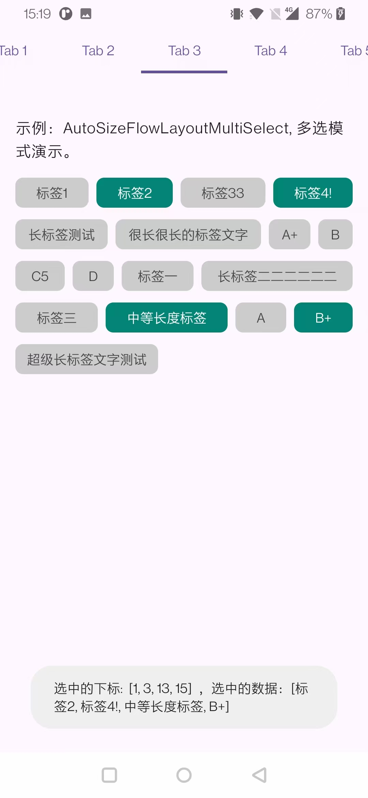
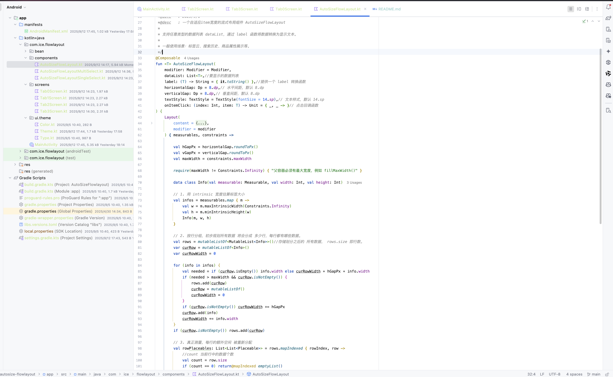
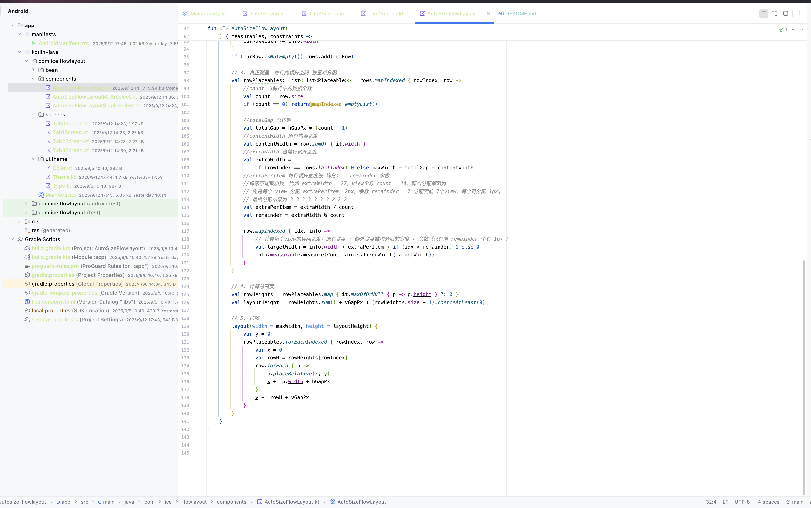

# autosize-flowlayout

自适应宽度的流式标签布局。

目前功能有：
1. 行尾剩余宽度均分到每一个标签view上，实现自适应宽度。
2. 支持任意类型的标签数据（如String、自定义Bean等）。
3. 支持单选、多选。

效果预览：

  
  

  
  

核心代码：

## summary

May this FlowLayout help you. Thanks.